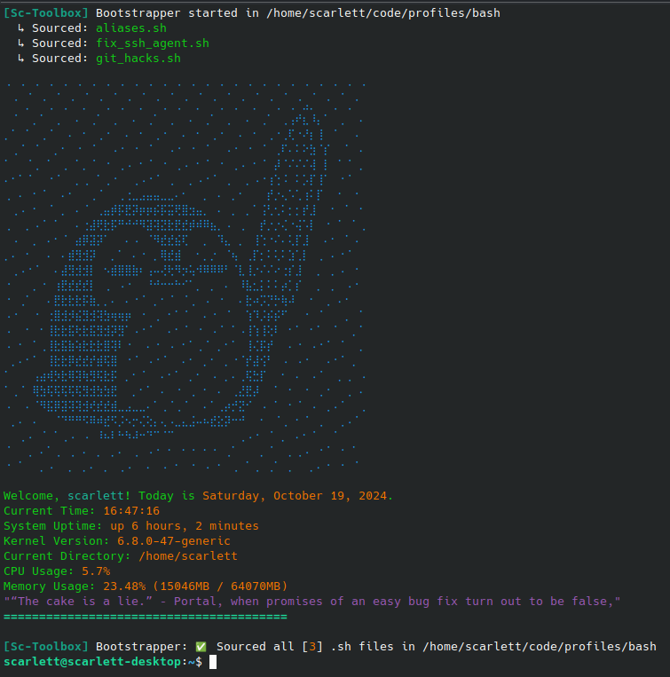

# Bash profile
This is just for me personal use so no quarantees.

just for fun all *.sh without an `_` will be loaded by it so its handy for aliases and just setting stuff up also use it for my keys.